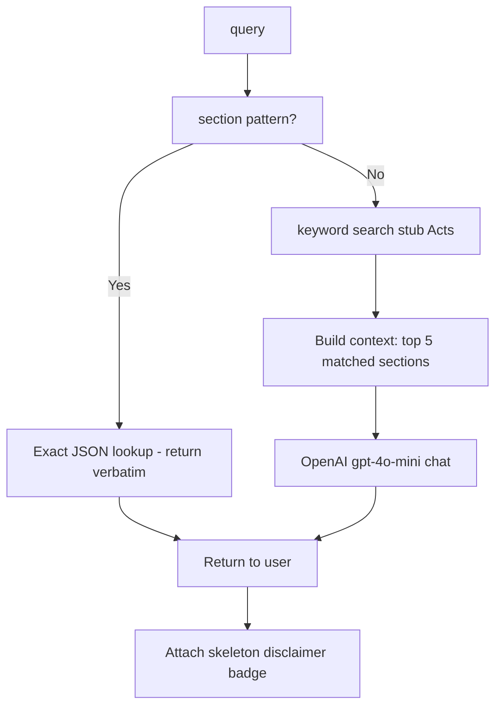
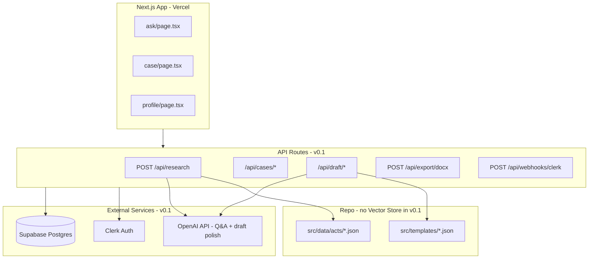

# Law Platform — End-to-End Implementation Plan

> **Executable spec for implementing agents.** Product behavior defined in `.cursor/plans/indian_advocate_platform_mvp_03c9ab9c.plan.md`.
>
> ## SHIP-FIRST STRATEGY (read this first)
>
> **v0.1 — Ship now (~2 weeks):** Constitution + Acts. Ask tab + basic drafting. **No case law yet.**
> **v0.2 — Circle back:** SC judgments, Vector Store, case citations in research and draft grounds.
>
> Do not block v0.1 on corpus curation, OpenAI Vector Store, or eval-qa case law gates.

---

## v0.1 scope (first ship)

| In skeleton v0.1 | Deferred to v0.2 |
|------------------|------------------|
| Ask tab — **all questions answered** (GPT + stub Acts) | Citation verifier, "Not found" gate |
| Exact section lookup (Art 21, 438 CrPC, etc.) | Full Acts JSON import |
| OpenAI `gpt-4o-mini` for general + case law Q&A | Vector Store + verified case citations |
| Stub Acts JSON injected as GPT context | Hindi section text |
| My Case + basic drafting (2 templates) | 4 more templates, firm `.docx` upload |
| Word export | Library tab |
| Disclaimer: "Verify independently" on AI answers | Strict anti-hallucination mode |
| Clerk + Supabase + **OpenAI** | Phone OTP / DLT |

**Skeleton user promise:** *"Ask anything about Indian law — get an answer. Look up sections exactly. Draft documents. Verify important citations with a senior advocate."*

---

## Skeleton build mode (what "end-to-end first" means)

User priority: **see the full product flow working**, not polish or efficiency. Build this skeleton in one pass (~3–5 days).

| Skeleton rule | Detail |
|---------------|--------|
| Acts data | **Stub JSON only** — 10–20 sections (Art 21, 226; CrPC 438–440; IPC 302; NI Act 138). Full Acts import later. |
| **OpenAI** | **Required** — powers all general Q&A and draft polish |
| Q&A mode | **Permissive skeleton** — answers **every** question (sections, Acts, case law, procedure). Accuracy not guaranteed. |
| Citation verifier / Not-found gate | **Skip in skeleton** — v0.2 adds strict mode |
| Section lookup | Still **exact** from JSON when user types "Section 438 CrPC" (best-quality answers) |
| General questions | GPT `gpt-4o-mini` with matched Act sections injected as context + model knowledge |
| Case law questions | GPT answers freely in skeleton — show banner: *"Verify citations independently"* |
| Templates | **2 templates minimum** — `anticipatory_bail.json` + `legal_notice.json` |
| UI | Functional, mobile-friendly, large buttons — **no design polish** |
| Library tab | **Hidden** — 3 tabs only |
| Voice | **Skip** — text input only |
| i18n | **English only** for skeleton |
| Rate limit | Skip for skeleton |
| Tests | Manual smoke test only |
| Legal pages | Disclaimer footer on every page + yellow banner on AI answers |

### Skeleton Q&A pipeline (`POST /api/research`)



**OpenAI skeleton system prompt:**
```
You are a legal research assistant for Indian advocates.
Help answer questions about Indian law clearly and practically.
When Act sections are provided in context, prefer those over general knowledge.
You may cite well-known Indian cases when relevant, but note the user must verify citations.
Keep answers under 200 words unless listing a statute section.
If unsure, say what you know and recommend consulting a senior advocate.
```

**Skeleton vs v0.2:**

| | Skeleton (now) | v0.2 (production) |
|--|----------------|-------------------|
| Section lookup | Exact JSON | Full Acts JSON |
| Case law | GPT (may hallucinate) | Vector Store + verifier |
| Wrong citation | Allowed with disclaimer | Blocked / "Not found" |
| OpenAI model | gpt-4o-mini | gpt-4o-mini + file_search |

### Skeleton E2E flow (must work demo-able)

```
Sign up (Clerk email) → Onboarding → Ask tab
  → "Article 21" → exact Constitution text
  → "What is anticipatory bail?" → GPT answer (with disclaimer)
  → "Can FIR be quashed after 3 years?" → GPT answer citing cases (verify banner shown)
  → follow-up question works in chat thread

My Case → New case → Anticipatory Bail → wizard → Preview → Download .docx
Profile → sign out
```

### What the implementing agent needs FROM YOU before starting

| Item | Required for skeleton? |
|------|------------------------|
| Clerk account + API keys | **Yes** |
| Supabase project + keys | **Yes** |
| **OpenAI API key** | **Yes** |
| Vercel account (or `npm run dev` locally) | **Yes** |
| Legal PDF corpus / Vector Store | **No** (v0.2) |
| DLT / SMS | **No** |

**Verdict: Plan is sufficient. Need Clerk + Supabase + OpenAI keys in `.env.local` to start.**

---

## 1. Architecture summary (v0.1)



### v0.2 adds
OpenAI Vector Store, Library tab, uploaded templates, case law pipeline, citation verifier, Whisper voice.

---

### Production database decision

The product plan used sessionStorage for lean MVP. **This implementation uses Supabase PostgreSQL** because production requires:

- Persisted cases and drafts (browser closes)
- **Personal library** — saved research, exported documents, case history
- Q&A audit trail (legal liability)
- Ask chat history per user
- Uploaded `.docx` template storage
- Row-level security tied to Clerk user ID

**Clerk** = authentication only. **Supabase** = all application data.

---

## 2. Tech stack and dependencies

### Install (after moving `law-app/` to repo root)

```bash
npm install @clerk/nextjs @supabase/supabase-js openai docx docxtemplater pizzip mammoth zod next-intl uuid dompurify isomorphic-dompurify
npm install -D vitest @testing-library/react supabase
```

| Package | Purpose |
|---------|---------|
| @clerk/nextjs | Auth, middleware, webhooks |
| @supabase/supabase-js | Postgres + Storage (server-side) |
| openai | Vector store, Responses API, Whisper |
| docx | Build Word docs from built-in templates |
| docxtemplater + pizzip | Fill placeholders in uploaded `.docx` |
| mammoth | Extract text/placeholders from upload |
| zod | Request validation |
| next-intl | English + Hindi UI |
| dompurify | Sanitize preview HTML |

---

## 3. Environment variables

```bash
# Clerk
NEXT_PUBLIC_CLERK_PUBLISHABLE_KEY=
CLERK_SECRET_KEY=
CLERK_WEBHOOK_SECRET=
NEXT_PUBLIC_CLERK_SIGN_IN_URL=/sign-in
NEXT_PUBLIC_CLERK_SIGN_UP_URL=/sign-up
NEXT_PUBLIC_CLERK_AFTER_SIGN_IN_URL=/ask
NEXT_PUBLIC_CLERK_AFTER_SIGN_UP_URL=/onboarding

# Supabase
NEXT_PUBLIC_SUPABASE_URL=
NEXT_PUBLIC_SUPABASE_ANON_KEY=
SUPABASE_SERVICE_ROLE_KEY=

# OpenAI (REQUIRED for skeleton Q&A + drafting)
OPENAI_API_KEY=
OPENAI_MODEL=gpt-4o-mini
# OPENAI_VECTOR_STORE_ID=          # v0.2 only

# App
NEXT_PUBLIC_APP_URL=https://your-domain.vercel.app
```

---

## 4. Database — Supabase PostgreSQL

### 4.1 `supabase/migrations/001_initial.sql`

```sql
CREATE EXTENSION IF NOT EXISTS "pgcrypto";

CREATE TABLE profiles (
  id UUID PRIMARY KEY DEFAULT gen_random_uuid(),
  clerk_user_id TEXT UNIQUE NOT NULL,
  full_name TEXT NOT NULL,
  state_code TEXT NOT NULL,
  language_pref TEXT NOT NULL DEFAULT 'en',
  bar_enrollment_no TEXT,
  practice_areas TEXT[] DEFAULT '{}',
  onboarding_complete BOOLEAN DEFAULT FALSE,
  created_at TIMESTAMPTZ DEFAULT NOW(),
  updated_at TIMESTAMPTZ DEFAULT NOW()
);
CREATE INDEX idx_profiles_clerk ON profiles(clerk_user_id);

CREATE TABLE cases (
  id UUID PRIMARY KEY DEFAULT gen_random_uuid(),
  user_id UUID NOT NULL REFERENCES profiles(id) ON DELETE CASCADE,
  title TEXT NOT NULL,
  matter_type TEXT NOT NULL,
  court_name TEXT,
  court_state TEXT,
  petitioner_name TEXT,
  respondent_name TEXT,
  offence_or_claim TEXT,
  facts_summary TEXT,
  status TEXT NOT NULL DEFAULT 'active',
  created_at TIMESTAMPTZ DEFAULT NOW(),
  updated_at TIMESTAMPTZ DEFAULT NOW()
);
CREATE INDEX idx_cases_user ON cases(user_id, status);

CREATE TABLE ask_sessions (
  id UUID PRIMARY KEY DEFAULT gen_random_uuid(),
  user_id UUID NOT NULL REFERENCES profiles(id) ON DELETE CASCADE,
  title TEXT,
  created_at TIMESTAMPTZ DEFAULT NOW(),
  updated_at TIMESTAMPTZ DEFAULT NOW()
);
CREATE INDEX idx_ask_sessions_user ON ask_sessions(user_id);

CREATE TABLE research_messages (
  id UUID PRIMARY KEY DEFAULT gen_random_uuid(),
  user_id UUID NOT NULL REFERENCES profiles(id) ON DELETE CASCADE,
  ask_session_id UUID REFERENCES ask_sessions(id) ON DELETE CASCADE,
  case_id UUID REFERENCES cases(id) ON DELETE CASCADE,
  role TEXT NOT NULL,
  content TEXT NOT NULL,
  query_type TEXT,
  sources JSONB DEFAULT '[]',
  raw_retrieval JSONB,
  created_at TIMESTAMPTZ DEFAULT NOW()
);
CREATE INDEX idx_research_messages_session ON research_messages(ask_session_id, created_at);
CREATE INDEX idx_research_messages_case ON research_messages(case_id, created_at);

CREATE TABLE case_citations (
  id UUID PRIMARY KEY DEFAULT gen_random_uuid(),
  case_id UUID NOT NULL REFERENCES cases(id) ON DELETE CASCADE,
  source_type TEXT NOT NULL,
  label TEXT NOT NULL,
  citation_text TEXT NOT NULL,
  metadata JSONB DEFAULT '{}',
  created_at TIMESTAMPTZ DEFAULT NOW()
);
CREATE INDEX idx_case_citations_case ON case_citations(case_id);

CREATE TABLE drafts (
  id UUID PRIMARY KEY DEFAULT gen_random_uuid(),
  case_id UUID NOT NULL REFERENCES cases(id) ON DELETE CASCADE,
  template_type TEXT NOT NULL,
  template_id TEXT NOT NULL,
  field_values JSONB NOT NULL DEFAULT '{}',
  legal_grounds TEXT,
  selected_citation_ids UUID[] DEFAULT '{}',
  generated_html TEXT,
  generated_doc_json JSONB,
  revision_count INT DEFAULT 0,
  status TEXT DEFAULT 'in_progress',
  created_at TIMESTAMPTZ DEFAULT NOW(),
  updated_at TIMESTAMPTZ DEFAULT NOW()
);
CREATE INDEX idx_drafts_case ON drafts(case_id);

CREATE TABLE uploaded_templates (
  id UUID PRIMARY KEY DEFAULT gen_random_uuid(),
  user_id UUID NOT NULL REFERENCES profiles(id) ON DELETE CASCADE,
  file_name TEXT NOT NULL,
  storage_path TEXT NOT NULL,
  placeholders JSONB NOT NULL,
  created_at TIMESTAMPTZ DEFAULT NOW()
);
CREATE INDEX idx_uploaded_templates_user ON uploaded_templates(user_id);

-- Personal library: explicitly saved research (sections, citations, answers)
CREATE TABLE library_saved_research (
  id UUID PRIMARY KEY DEFAULT gen_random_uuid(),
  user_id UUID NOT NULL REFERENCES profiles(id) ON DELETE CASCADE,
  item_type TEXT NOT NULL,           -- 'section' | 'case_citation' | 'research_answer'
  label TEXT NOT NULL,               -- "Section 438 CrPC" or case name
  content TEXT NOT NULL,             -- snapshot: section text or citation block
  sources JSONB DEFAULT '[]',        -- full CitationSource[] at time of save
  notes TEXT,                        -- advocate's private note
  tags TEXT[] DEFAULT '{}',
  source_message_id UUID REFERENCES research_messages(id) ON DELETE SET NULL,
  source_case_id UUID REFERENCES cases(id) ON DELETE SET NULL,
  created_at TIMESTAMPTZ DEFAULT NOW()
);
CREATE INDEX idx_library_saved_user ON library_saved_research(user_id, created_at DESC);
CREATE INDEX idx_library_saved_type ON library_saved_research(user_id, item_type);

-- Personal library: exported documents (auto-saved on download)
CREATE TABLE library_document_exports (
  id UUID PRIMARY KEY DEFAULT gen_random_uuid(),
  user_id UUID NOT NULL REFERENCES profiles(id) ON DELETE CASCADE,
  case_id UUID REFERENCES cases(id) ON DELETE SET NULL,
  draft_id UUID REFERENCES drafts(id) ON DELETE SET NULL,
  file_name TEXT NOT NULL,           -- "Anticipatory_Bail_Rajesh_Kumar.docx"
  storage_path TEXT NOT NULL,        -- supabase storage path
  template_name TEXT,                -- "Anticipatory Bail Application"
  matter_type TEXT,
  exported_at TIMESTAMPTZ DEFAULT NOW()
);
CREATE INDEX idx_library_docs_user ON library_document_exports(user_id, exported_at DESC);

CREATE TABLE qa_audit_logs (
  id UUID PRIMARY KEY DEFAULT gen_random_uuid(),
  user_id UUID REFERENCES profiles(id),
  query TEXT NOT NULL,
  query_type TEXT NOT NULL,
  route_taken TEXT NOT NULL,
  sources_returned JSONB,
  citations_verified INT DEFAULT 0,
  citations_stripped INT DEFAULT 0,
  latency_ms INT,
  created_at TIMESTAMPTZ DEFAULT NOW()
);
CREATE INDEX idx_qa_audit_created ON qa_audit_logs(created_at);

CREATE OR REPLACE FUNCTION set_updated_at()
RETURNS TRIGGER AS $$
BEGIN NEW.updated_at = NOW(); RETURN NEW; END;
$$ LANGUAGE plpgsql;

CREATE TRIGGER profiles_updated BEFORE UPDATE ON profiles FOR EACH ROW EXECUTE FUNCTION set_updated_at();
CREATE TRIGGER cases_updated BEFORE UPDATE ON cases FOR EACH ROW EXECUTE FUNCTION set_updated_at();
CREATE TRIGGER ask_sessions_updated BEFORE UPDATE ON ask_sessions FOR EACH ROW EXECUTE FUNCTION set_updated_at();
CREATE TRIGGER drafts_updated BEFORE UPDATE ON drafts FOR EACH ROW EXECUTE FUNCTION set_updated_at();
```

### 4.2 Storage buckets

- `uploaded-templates` (private) — path: `{clerk_user_id}/{uuid}.docx`
- `generated-docs` (private) — path: `{clerk_user_id}/{export_id}.docx` — **every export saved here for Library re-download**

### 4.3 Access pattern

All DB writes go through Next.js API routes using `SUPABASE_SERVICE_ROLE_KEY`. Every query filters by `profiles.id` resolved from Clerk `userId`. Never expose service role key to client.

---

## 5. TypeScript types — `src/lib/types/index.ts`

```typescript
export type LanguagePref = 'en' | 'hi';
export type QueryType = 'section' | 'case_law' | 'mixed' | 'not_found';
export type MatterType =
  | 'bail' | 'anticipatory_bail' | 'legal_notice'
  | 'writ' | 'plaint' | 'affidavit' | 'other';

export interface CitationSource {
  type: 'section' | 'case_law';
  label: string;
  citationText: string;
  act?: string;
  section?: string;
  caseName?: string;
  year?: number;
  court?: string;
  sourceFile?: string;
}

export interface ActSection {
  act: string;
  actFullName: string;
  section: string;
  title: string;
  textEnglish: string;
  textHindi?: string;
}

export interface TemplateField {
  key: string;
  labelEn: string;
  labelHi: string;
  required: boolean;
  type: 'text' | 'date' | 'textarea';
}

export interface TemplateSection {
  id: string;
  headingEn: string;
  headingHi: string;
  bodyTemplate: string;
  isLegalGrounds?: boolean;
}

export interface BuiltinTemplate {
  id: string;
  nameEn: string;
  nameHi: string;
  matterType: MatterType;
  sections: TemplateSection[];
  fields: TemplateField[];
}
```

### Acts JSON format — `src/data/acts/crpc.json`

```json
{
  "act": "CrPC",
  "actFullName": "Code of Criminal Procedure, 1973",
  "sections": [
    {
      "section": "438",
      "title": "Direction for grant of bail to person apprehending arrest",
      "textEnglish": "…",
      "textHindi": "…"
    }
  ]
}
```

Acts to build: `constitution.json`, `ipc.json`, `crpc.json`, `cpc.json`, `iea.json`, `nia.json`

---

## 6. Complete API specification

All routes except webhook require Clerk session via `auth()` from `@clerk/nextjs/server`.

Standard error shape: `{ "error": "message", "code": "ERROR_CODE" }`

### 6.1 `POST /api/webhooks/clerk`

- Verify Svix signature with `CLERK_WEBHOOK_SECRET`
- Events: `user.created`, `user.updated`
- Upsert `profiles` row with `clerk_user_id`, email from Clerk payload
- Set `onboarding_complete = false` on create

### 6.2 `GET /api/profile`

Returns current user profile from `profiles` by Clerk ID.

### 6.3 `POST /api/profile/onboarding`

**Request:**
```json
{
  "fullName": "Adv. Rajesh Kumar",
  "stateCode": "MH",
  "languagePref": "hi",
  "barEnrollmentNo": "MH/1234/2019"
}
```

**Logic:** Update profile; set `onboarding_complete = true`; sync to Clerk `publicMetadata`.

### 6.4 `POST /api/research` — CORE

#### v0.1 skeleton pipeline (OpenAI — answers everything, permissive)

1. `parseQuery(query)` — if section/article pattern → **exact JSON lookup** (skip GPT)
2. Else → keyword search stub Acts → collect top 5 sections as `contextBlock`
3. Call OpenAI chat:
   ```typescript
   openai.chat.completions.create({
     model: process.env.OPENAI_MODEL ?? 'gpt-4o-mini',
     messages: [
       { role: 'system', content: SKELETON_SYSTEM_PROMPT },
       ...conversationHistory,
       { role: 'user', content: contextBlock ? `Context from Acts:\n${contextBlock}\n\nQuestion: ${query}` : query }
     ]
   });
   ```
4. Return `{ queryType: 'ai_answer', answer, sources: matchedSections, skeletonMode: true }`
5. Save message + audit log

**No not-found gate. No citation verifier in skeleton.**

#### v0.2 pipeline (strict — add case law)

Add Vector Store file_search, citation verifier, not-found gate. Replace permissive GPT for case-law with retrieval-only.

<!-- Previous v0.1 restrictive pipeline removed for skeleton -->

**Request:**
```json
{
  "query": "Section 438 CrPC",
  "askSessionId": "uuid | null",
  "caseId": "uuid | null",
  "conversationHistory": [
    { "role": "user", "content": "…" },
    { "role": "assistant", "content": "…" }
  ],
  "languagePref": "hi"
}
```

**Response (success):**
```json
{
  "queryType": "section | case_law | mixed | not_found",
  "answer": "…",
  "answerHi": "…",
  "sources": [ /* CitationSource[] */ ],
  "messageId": "uuid",
  "notFound": false
}
```

**Pipeline (`src/lib/research/pipeline.ts`) — v0.2 adds case-law steps:**

1. `parseQuery(query)` — detect section/article pattern
2. If section pattern → `lookupSection(act, section)` from JSON files
3. *(v0.2)* case-law search via Vector Store
4. *(v0.2)* citation verifier
5. Save user message + assistant message to `research_messages`
6. Insert `qa_audit_logs`

**v0.1 keyword search (`src/lib/acts/keyword-search.ts`):**
- Tokenize query; score sections by term frequency in title + textEnglish
- Return top 5 sections with score > threshold
- Pass to GPT only if user question is not a pure section lookup

**Section regex (`src/lib/research/parse-query.ts`):**
```typescript
/(?:section|sec|s\.?|article|art\.?)\s*(\d+[A-Za-z]?)\s*(?:of\s*)?(ipc|crpc|cpc|iea|evidence act|ni act|constitution)?/i
```

Also map bare `"438 CrPC"` without "Section" prefix.

<!-- v0.2: OpenAI case law search — see git history or v0.2 section -->

**Rate limit:** 20 requests/minute/user.

### 6.5 `GET /api/lookup/section?act=CrPC&section=438&lang=en`

Direct section lookup. Returns `{ found: true, section: ActSection }` or 404.

### 6.6 Ask session APIs

| Method | Route | Purpose |
|--------|-------|---------|
| GET | `/api/ask/sessions` | List user sessions |
| POST | `/api/ask/sessions` | Create session `{ id }` |
| GET | `/api/ask/sessions/[id]/messages` | Get messages |
| DELETE | `/api/ask/sessions/[id]` | Delete session |

### 6.7 Case APIs

| Method | Route | Purpose |
|--------|-------|---------|
| GET | `/api/cases` | List active cases |
| POST | `/api/cases` | Create case (CaseFacts body) |
| GET | `/api/cases/[id]` | Case + citations + latest draft |
| PATCH | `/api/cases/[id]` | Update facts |
| DELETE | `/api/cases/[id]` | Archive (`status=archived`) |
| GET | `/api/cases/[id]/messages` | Case research messages |
| POST | `/api/cases/[id]/citations` | Add citation to case |
| GET | `/api/cases/[id]/citations` | List citations |
| DELETE | `/api/cases/[id]/citations/[citationId]` | Remove citation |

**POST /api/cases/[id]/citations body:**
```json
{
  "sourceType": "case_law",
  "label": "Arnesh Kumar v. State of Bihar (2014)",
  "citationText": "…",
  "metadata": {}
}
```

### 6.8 Draft APIs

| Method | Route | Purpose |
|--------|-------|---------|
| GET | `/api/draft/templates` | List built-in templates |
| POST | `/api/template/upload` | Upload `.docx` (multipart, max 5MB) |
| POST | `/api/draft/start` | Start draft for case |
| GET | `/api/draft/[id]` | Get draft state |
| POST | `/api/draft/[id]/fields` | Save field values |
| POST | `/api/draft/[id]/generate` | Generate preview HTML |
| POST | `/api/draft/[id]/revise` | Apply revision instruction (max 5) |
| POST | `/api/export/docx` | Download Word file |

**POST /api/draft/start:**
```json
{
  "caseId": "uuid",
  "templateType": "builtin | uploaded",
  "templateId": "anticipatory_bail | uploaded-template-uuid"
}
```

**POST /api/draft/[id]/generate logic (v0.1):**
1. Load template schema + `field_values`
2. Legal grounds sections: insert user-provided text OR placeholder *"[Add supporting case citations]"*
3. Other sections: replace `{{key}}` with field values
4. Optional GPT polish on facts paragraphs — strict prompt: do not add facts
5. Store `generated_html` + `generated_doc_json`; return preview

<!-- v0.2: pull legal grounds from case_citations + Vector Store -->

**POST /api/export/docx (v0.1):**
- Built-in template → build with `docx` package
- Stream binary to client
- *(v0.2: uploaded template via docxtemplater, auto-save to Library)*

### 6.9 Library APIs — **v0.2 only**

Defer entire Library tab and `/api/library/*` to v0.2. v0.1 nav: **Ask | My Case | Profile** (3 tabs).

<!--

| Method | Route | Purpose |
|--------|-------|---------|
| GET | `/api/library` | Dashboard: counts + recent items (all 4 sections) |
| GET | `/api/library/cases` | All cases (active + archived), newest first |
| GET | `/api/library/saved-research` | Bookmarked sections/citations/answers |
| POST | `/api/library/saved-research` | Save item to library |
| PATCH | `/api/library/saved-research/[id]` | Update notes/tags |
| DELETE | `/api/library/saved-research/[id]` | Remove bookmark |
| GET | `/api/library/documents` | Exported `.docx` list |
| GET | `/api/library/documents/[id]/download` | Re-download saved document |
| DELETE | `/api/library/documents/[id]` | Delete from library |
| GET | `/api/library/conversations` | Past Ask sessions with preview |
| GET | `/api/library/templates` | User's uploaded templates |

**POST /api/library/saved-research body:**
```json
{
  "itemType": "section | case_citation | research_answer",
  "label": "Section 438 CrPC",
  "content": "438. Direction for grant of bail…",
  "sources": [ /* CitationSource[] */ ],
  "notes": "Use for AB matters in Sessions Court",
  "tags": ["bail", "crpc"],
  "sourceMessageId": "uuid-or-null",
  "sourceCaseId": "uuid-or-null"
}
```

**GET /api/library response (dashboard):**
```json
{
  "counts": {
    "activeCases": 3,
    "archivedCases": 12,
    "savedResearch": 28,
    "documents": 15,
    "conversations": 9,
    "templates": 2
  },
  "recentCases": [ /* last 5 */ ],
  "recentDocuments": [ /* last 5 */ ],
  "recentSavedResearch": [ /* last 5 */ ]
}
```

**Save triggers in UI:**
- `CitationCard` → **Save to Library** button (every citation)
- Full research answer bubble → **Save answer** button
- Export docx → auto-saved (no user action needed)
- Cases → auto-saved on create
- Ask chats → auto-saved per session
-->

### 6.10 `POST /api/voice/transcribe` — **v0.2** (use Web Speech API only in v0.1)

Multipart `audio` field → OpenAI Whisper `whisper-1` → `{ text: "…" }`

---

## 7. Data scripts

### v0.1 (required)

**`scripts/build-acts-json.ts`** — Convert source text → `src/data/acts/*.json` for Constitution, IPC, CrPC, CPC, IEA, NI Act.

Sources: India Code (https://www.indiacode.nic.in) — public domain Act text. English only for v0.1.

**`scripts/verify-acts.ts`** — Smoke test: lookup 20 known sections (Art 21, 438 CrPC, 302 IPC) returns text.

### v0.2 (defer)

**`scripts/upload-corpus.ts`** — PDFs → OpenAI Vector Store  
**`scripts/eval-qa.ts`** — 50-question case law eval

---

## 7b. OpenAI Vector Store scripts (v0.2 — do not run for first ship)

### `scripts/upload-corpus.ts`

1. Read `scripts/data/manifest.json` (500 landmark + recent SC PDFs)
2. Upload each PDF: `openai.files.create({ purpose: 'assistants' })`
3. Create vector store: `openai.vectorStores.create({ name: 'indian-case-law-mvp' })`
4. Batch attach files; poll until complete
5. Print `OPENAI_VECTOR_STORE_ID` for `.env`

**Manifest entry:**
```json
{
  "path": "corpus/2014_arnesh_kumar.pdf",
  "caseName": "Arnesh Kumar v. State of Bihar",
  "year": 2014,
  "court": "SC"
}
```

### `scripts/build-acts-json.ts`

Convert source text → `src/data/acts/*.json`

### `scripts/eval-qa.ts`

Run 50 questions from `eval/questions.json` against live `/api/research`. Output CSV. **Gate: 0 hallucinated citations.**

---

## 8. Frontend routes and components

### Routes

| Route | Page | Notes |
|-------|------|-------|
| `/` | redirect → `/ask` | |
| `/sign-in` | Clerk SignIn | |
| `/sign-up` | Clerk SignUp | |
| `/onboarding` | OnboardingWizard | Block until complete |
| `/ask` | AskPage | Default landing |
| `/case` | CaseListPage | |
| `/case/new` | NewCasePage | |
| `/case/[id]` | CaseWorkspacePage | Facts + Research + Draft |
| `/library` | LibraryPage | **v0.2 only** |
| `/profile` | ProfilePage | |

### v0.1 navigation: **Ask | My Case | Profile** (3 tabs)

### `src/middleware.ts`

Clerk `authMiddleware` protecting all routes except `/sign-in`, `/sign-up`, `/api/webhooks/clerk`.

### `src/components/layout/app-shell.tsx`

Bottom nav (mobile): **Ask | My Case | Profile** — 3 tabs in v0.1; add Library in v0.2.

### Key components

| Component | Path | Responsibility |
|-----------|------|----------------|
| AppShell | `components/layout/app-shell.tsx` | 4-tab nav; scope banner |
| ResearchChat | `components/research/research-chat.tsx` | Shared chat; props: `mode: ask \| case` |
| CitationCard | `components/research/citation-card.tsx` | Copy; Save to Library; Add to draft / Use in my case |
| SaveToLibraryButton | `components/library/save-button.tsx` | POST saved-research; toast confirmation |
| LibraryDashboard | `components/library/library-dashboard.tsx` | 4 section cards with counts |
| LibraryCasesList | `components/library/cases-list.tsx` | Active + archived cases |
| LibrarySavedList | `components/library/saved-research-list.tsx` | Bookmarks with search/filter by tag |
| LibraryDocumentsList | `components/library/documents-list.tsx` | Re-download `.docx` |
| LibraryConversationsList | `components/library/conversations-list.tsx` | Past Ask chats → reopen |
| LibraryTemplatesList | `components/library/templates-list.tsx` | Uploaded firm templates |
| VoiceInput | `components/voice-input.tsx` | Web Speech + Whisper fallback + confirm modal |
| CaseFactsForm | `components/case/case-facts-form.tsx` | Large fields, Hindi labels |
| CaseWorkspace | `components/case/case-workspace.tsx` | Facts \| Research \| Draft sections |
| DraftWizard | `components/draft/draft-wizard.tsx` | 5-step wizard |
| TemplatePicker | `components/draft/template-picker.tsx` | 6 built-in + upload dropzone |
| DocumentPreview | `components/draft/document-preview.tsx` | Sanitized HTML preview |

### i18n

`src/messages/en.json` and `src/messages/hi.json` — all user-facing strings including wizard questions, not-found messages, disclaimers.

---

## 9. Built-in templates — `src/templates/`

| File | id |
|------|-----|
| `regular_bail.json` | regular_bail |
| `anticipatory_bail.json` | anticipatory_bail |
| `legal_notice.json` | legal_notice |
| `writ_petition.json` | writ_petition |
| `plaint.json` | plaint |
| `affidavit.json` | affidavit |

Shared criminal fields: `petitioner_name`, `respondent_name`, `fir_number`, `police_station`, `offence_sections`, `facts`, `court_name`, `date`

---

## 10. Security checklist

- [ ] Clerk middleware on all pages and API routes (except webhook)
- [ ] Zod validation on every POST body
- [ ] All DB queries scoped to authenticated user's `profiles.id`
- [ ] Rate limit: 20 research/min, 10 generate/hour
- [ ] Upload: max 5MB, `.docx` MIME only
- [ ] DOMPurify on `generated_html` before render
- [ ] Server-only env vars (OpenAI, Supabase service role)
- [ ] `qa_audit_logs` on every research call
- [ ] Disclaimer footer on every page

---

## 11. Error codes

| Code | HTTP | When |
|------|------|------|
| UNAUTHORIZED | 401 | No session |
| FORBIDDEN | 403 | Not owner |
| NOT_FOUND | 404 | Missing resource |
| VALIDATION_ERROR | 400 | Zod fail |
| RATE_LIMITED | 429 | Too many requests |
| REVISION_LIMIT | 400 | revision_count > 5 |
| UPLOAD_INVALID | 400 | Bad file |

---

## 12. Complete file tree

```
Law2/
├── IMPLEMENTATION_PLAN.md          ← this file
├── supabase/migrations/001_initial.sql
├── scripts/
│   ├── upload-corpus.ts
│   ├── build-acts-json.ts
│   ├── eval-qa.ts
│   └── data/manifest.json
├── eval/questions.json
├── corpus/                         # gitignored PDFs
├── src/
│   ├── middleware.ts
│   ├── app/
│   │   ├── layout.tsx
│   │   ├── page.tsx
│   │   ├── sign-in/[[...sign-in]]/page.tsx
│   │   ├── sign-up/[[...sign-up]]/page.tsx
│   │   ├── onboarding/page.tsx
│   │   ├── (main)/layout.tsx
│   │   ├── (main)/ask/page.tsx
│   │   ├── (main)/case/page.tsx
│   │   ├── (main)/case/new/page.tsx
│   │   ├── (main)/case/[id]/page.tsx
│   │   ├── (main)/library/page.tsx
│   │   ├── (main)/library/saved/[id]/page.tsx
│   │   ├── (main)/profile/page.tsx
│   │   └── api/
│   │       ├── library/route.ts
│   │       ├── library/cases/route.ts
│   │       ├── library/saved-research/route.ts
│   │       ├── library/saved-research/[id]/route.ts
│   │       ├── library/documents/route.ts
│   │       ├── library/documents/[id]/route.ts
│   │       ├── library/documents/[id]/download/route.ts
│   │       ├── library/conversations/route.ts
│   │       ├── library/templates/route.ts
│   │       └── … (other routes from section 6)
│   ├── components/library/           # LibraryDashboard, lists, save-button
│   ├── lib/
│   │   ├── types/index.ts
│   │   ├── supabase/server.ts
│   │   ├── research/pipeline.ts
│   │   ├── research/parse-query.ts
│   │   ├── research/citation-verifier.ts
│   │   ├── acts/lookup.ts
│   │   ├── openai/client.ts
│   │   ├── openai/case-law-search.ts
│   │   ├── drafting/template-loader.ts
│   │   ├── drafting/html-renderer.ts
│   │   ├── drafting/docx-builder.ts
│   │   ├── drafting/docx-templater.ts
│   │   ├── validation/*.ts
│   │   └── rate-limit.ts
│   ├── data/acts/*.json
│   ├── templates/*.json
│   └── messages/en.json, hi.json
└── .env.local.example
```

---

## 13. Phased build checklist

### v0.1 — SKELETON SHIP (~3–5 days, end-to-end demo)

**Goal:** Every screen and API wired. Stub data OK. Ugly OK. Must demo full flow.

#### Day 1 — Scaffold
- [ ] Move `law-app/` to root; install deps
- [ ] Supabase migration (profiles, cases, ask_sessions, research_messages, drafts — skip library tables)
- [ ] Clerk auth + webhook + onboarding
- [ ] 3-tab AppShell: Ask / My Case / Profile
- [ ] Disclaimer footer

#### Day 2 — Ask (OpenAI powered)
- [ ] Stub `src/data/acts/` JSON files
- [ ] `lookup.ts` + `keyword-search.ts`
- [ ] `src/lib/openai/chat.ts` — skeleton Q&A helper
- [ ] `POST /api/research` — exact lookup OR GPT with Act context
- [ ] Ask page: chat UI, copy button, **yellow "Verify independently" banner** on AI answers

#### Day 3 — Cases + Draft API
- [ ] Case CRUD APIs
- [ ] 2 template JSON files (anticipatory_bail, legal_notice)
- [ ] Draft start → fields → generate → export docx APIs
- [ ] `docx-builder.ts` — basic formatting

#### Day 4 — My Case UI
- [ ] Case list + new case form
- [ ] Case workspace: facts + embedded research + draft wizard
- [ ] Preview HTML + download button

#### Day 5 — Wire + deploy
- [ ] End-to-end manual test (checklist below)
- [ ] Fix broken flows
- [ ] Vercel deploy (or document local demo)

**Skeleton smoke checklist:**
- [ ] Sign up → onboarding → lands on Ask
- [ ] "Article 21" returns exact text (no GPT)
- [ ] "438 CrPC" returns exact text
- [ ] "What is anticipatory bail?" returns GPT answer with disclaimer banner
- [ ] "Can FIR be quashed after 3 years?" returns GPT answer (not blocked)
- [ ] Follow-up question in same chat works
- [ ] Create case → draft anticipatory bail → download .docx
- [ ] All 3 tabs work on mobile width

---

### v0.1 — FULL (after skeleton validated, ~+1 week)

#### Phase 0 — Scaffold (Days 1–2)
- [ ] Move `law-app/` to repo root; install deps (no docxtemplater yet)
- [ ] Supabase: profiles, cases, ask_sessions, research_messages, drafts (skip library tables for now)
- [ ] Clerk email auth + webhook + onboarding
- [ ] 3-tab shell: Ask / My Case / Profile
- [ ] Scope banner: *"Covers Constitution and central Acts. Case law coming soon."*

#### Phase 1 — Acts + Ask (Days 3–5)
- [ ] `build-acts-json.ts` — Constitution + 5 Acts (English)
- [ ] `lookup.ts` + `keyword-search.ts`
- [ ] `GET /api/lookup/section`
- [ ] `POST /api/research` v0.1 pipeline (exact + keyword + Act-only GPT summarize)
- [ ] Ask tab UI: search, chat, copy section text
- [ ] `verify-acts.ts` passes 20 sections

#### Phase 2 — Basic drafting (Days 6–9)
- [ ] 6 built-in template JSON files (structure + placeholders)
- [ ] Case CRUD + workspace UI
- [ ] Draft wizard: pick template → facts → preview → revise → export
- [ ] Legal grounds = placeholder or user text (no case citations)
- [ ] `POST /api/export/docx`

#### Phase 3 — Ship v0.1 (Days 10–12)
- [ ] Disclaimers on every page
- [ ] Rate limiting (in-memory OK for beta)
- [ ] Vercel deploy
- [ ] Manual smoke: Art 21, 438 CrPC, one bail draft downloaded

---

### v0.2 — CASE LAW + LIBRARY (circle back)

- [ ] Curate 500 SC PDFs; `upload-corpus.ts`
- [ ] Vector Store + case-law pipeline + citation verifier
- [ ] Library tab + APIs
- [ ] Upload firm `.docx` template
- [ ] Whisper voice API
- [ ] `eval-qa.ts` — 0 hallucinated citations
- [ ] Phone OTP (DLT)

---

### Original full checklist (reference — superseded by v0.1/v0.2 split above)

#### Phase 0 — Scaffold (Days 1–3)
- [ ] Move `law-app/` to repo root
- [ ] Install dependencies
- [ ] Create Supabase project; run migration; create storage buckets
- [ ] Configure Clerk; webhook → profiles sync
- [ ] Middleware + AppShell (4-tab nav)
- [ ] Onboarding page + profile APIs
- [ ] i18n setup (en + hi)

### Phase 1 — Acts lookup (Days 4–6)
- [ ] `build-acts-json.ts` for all 6 Acts
- [ ] `src/lib/acts/lookup.ts`
- [ ] `GET /api/lookup/section`
- [ ] Unit tests for parse-query and lookup

### Phase 2 — Case law + research API (Days 7–10)
- [ ] Curate manifest; run `upload-corpus.ts`
- [ ] `case-law-search.ts` + `citation-verifier.ts`
- [ ] `POST /api/research` full pipeline + audit logs
- [ ] Run `eval-qa.ts` — 0 hallucinations required

### Phase 3 — Ask tab (Days 11–13)
- [ ] Ask session APIs
- [ ] ResearchChat component
- [ ] `/ask` page complete

### Phase 4 — Cases (Days 14–17)
- [ ] All case + citation APIs
- [ ] Case list, new case, workspace with embedded ResearchChat
- [ ] "Use in my case" from Ask tab

### Phase 5 — Drafting (Days 18–24)
- [ ] 6 template JSON files
- [ ] Draft APIs + DraftWizard
- [ ] Template upload + docxtemplater export
- [ ] Preview, revise (max 5), `.docx` download
- [ ] **Auto-save every export to `library_document_exports` + Storage**

### Phase 5b — Library (Days 24–26)
- [ ] Library APIs (section 6.9)
- [ ] Save to Library button on CitationCard + research answers
- [ ] `/library` page with 4 sections (Cases, Saved Research, Documents, Conversations)
- [ ] Re-download documents; reopen past Ask conversations
- [ ] Notes/tags on saved research items

### Phase 6 — Production (Days 27–30)
- [ ] Rate limiting, DOMPurify, error toasts
- [ ] Legal disclaimers
- [ ] Vitest tests
- [ ] Vercel deploy + mobile smoke test

---

## 14. Launch gates

### v0.1 skeleton gates

1. "Article 21" / "438 CrPC" → exact text (< 2s)
2. Any general legal question → GPT answer (not empty, not blocked)
3. Follow-up in chat works
4. Bail draft → `.docx` downloads
5. Disclaimer visible on AI answers

### v0.2 gates (strict accuracy — circle back)

1. 50-question eval: 0 fabricated citations
2. Library save + re-download
3. Citation → Add to draft grounds

---

## 15. Deployment (v0.1)

1. Connect repo to Vercel; root `/`
2. Set all env vars from section 3
3. Clerk webhook: `https://{domain}/api/webhooks/clerk`
4. *(v0.2)* Run `upload-corpus.ts`; add `OPENAI_VECTOR_STORE_ID`
5. Run Supabase migrations against production project
